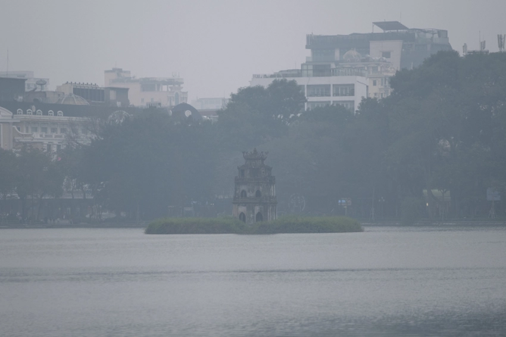
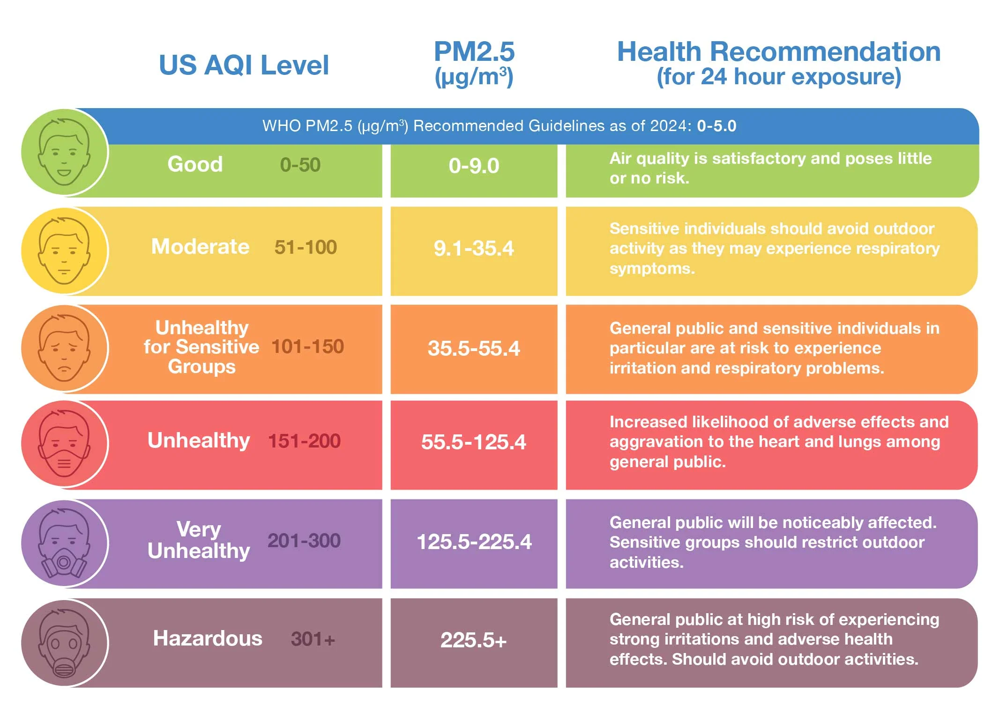

# Hanoi Air Quality Analysis and Prediction

  

## I. Introduction

This project was conducted as part of our second-year Machine Learning group project at [USTH](https://usth.edu.vn/en/). It focuses on analyzing and predicting Hanoi’s Air Quality Index (AQI) using weather-, time-, and pollution-related features. The workflow combines exploratory data analysis, feature engineering, and linear regression modeling to better understand local air quality patterns and generate a real-time AQI estimate from live environmental data.

For me, this topic is also personal. I come from Quy Nhon, where the air quality is usually much better, so pollution was never something I paid close attention to before moving to Hanoi for university. After arriving here, one of the biggest differences I noticed was the air itself: some mornings looked foggy even after sunrise, and even short periods outside could leave my throat dry and my eyes uncomfortable. That experience made AQI prediction feel less like a class requirement and more like a meaningful problem to study.

This README serves as a short project overview. For full implementation details, preprocessing steps, model design, and evaluation, please refer to the Jupyter notebook in this repository.

---

## II. Background Study

[Air Quality Index](https://www.iqair.com/vi/newsroom/resources-what-is-aqi) (AQI) is a standardized indicator used to describe how clean or polluted the air is, along with the related health implications. Higher AQI values indicate greater health concern. In practice, AQI categories help translate pollutant measurements into a more understandable public-health warning system.

  

In this study, AQI is treated as the target variable for prediction. Since AQI reflects the combined effect of pollutant concentration and atmospheric conditions, it is suitable for regression-based modeling. This also makes the prediction result easier to interpret than predicting a single pollutant concentration alone.

---

## III. Data Gathering

The project uses data from [Open-Meteo](https://open-meteo.com/), including both weather and air-quality variables for Hanoi. The historical dataset supports model training and evaluation, while the real-time pipeline retrieves the latest environmental conditions to generate a live AQI estimate.

The feature set includes:
- temperature
- relative humidity
- wind speed
- precipitation
- hour of day
- day of week
- PM2.5
- PM10
- carbon monoxide
- nitrogen dioxide
- ozone
- sulphur dioxide
- AQI lag features from recent hourly values

To better capture non-linear relationships, additional interaction features were engineered before training the regression model.

---

## IV. Result

The trained model produces a real-time AQI prediction for Hanoi using the latest data from Open-Meteo. In the current test run, the model predicts an AQI of approximately **180**, while IQAir reports Hanoi at around **175**.

This difference is relatively small for a live environmental prediction setting and still places both values in the same general air-quality condition: **unhealthy**. In other words, the model is not matching the external reading perfectly, but it is estimating the air quality in the correct severity range.

Overall, the result suggests that the model captures the short-term AQI trend reasonably well. While this is still a simple linear-regression-based approach, it provides a useful baseline for understanding AQI behavior and for comparing model estimates with real-world monitoring platforms.

For the full implementation and testing process, I have set up a notebook for this part named [Linear_reg.ipynb](Linear_reg.ipynb). Feel free to access it to see my data extraction and other process.

---

## V. Air Pollution Advisory

According to [New York State Department of Health](https://www.health.ny.gov/environmental/indoors/air/pmq_a.htm#:~:text=Spend%20more%20time%20indoors.,air%20conditioning%20if%20you%20can.), if AQI is at unhealthy levels, several steps can be taken:

**Outdoor activity**
- Wear masks: If going outdoors is unavoidable, consider wearing N95 or similar masks designed to filter out particulate matter from the air.
- Limit exertion: Avoid strenuous activities like running or cycling. Breathe shallowly if possible, as deep breaths bring in more polluted air.
- Sensitive groups should reduce outdoor exposure even more carefully.
- Personally, I rarely go outside anyway *lol*, so Hanoi air and I already have a peace treaty.

**Indoor activity**
- Keep windows closed when outdoor air quality is poor.
- Use fans or air purifiers if available.
- Avoid bringing polluted outdoor air inside unnecessarily during peak pollution hours.

In general, AQI information is most useful when it changes behavior. Even a simple prediction system can help people decide when to go out, when to stay in, and when to take extra precautions.

<h1 align="center">STAY SAFE Y’ALL!</h1>

